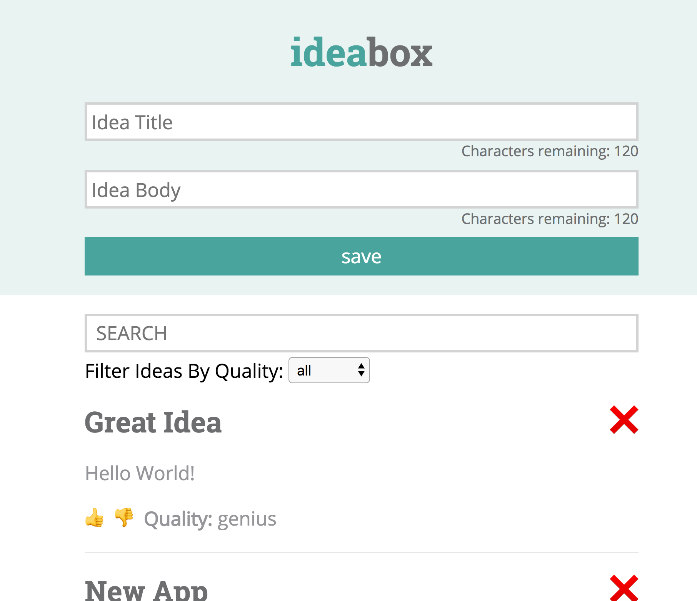

# ideabox

This app serves as practice for building applications with react and writing tests with jest and enzyme.

To start, clone down this repo and run `npm install` then `npm start`.

To run the test suite, run `npm test`.

To lint the scripts folder, run `npm run eslint`.

 

For practice, erase the files in the __tests__/ and scripts/ folders and build your own ideabox!